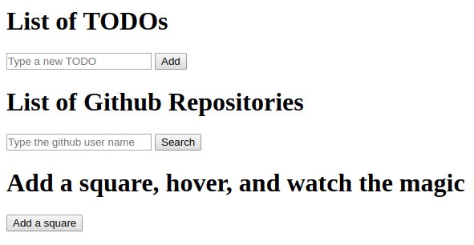

<!-- <h1 align="center">
    
</h1> -->

<h2 align="center">
  Learning JavaScript
</h2>

  

  
  
  

  

  

  <a href="#about">About</a>&nbsp;&nbsp;&nbsp;|&nbsp;&nbsp;&nbsp;
  <!--<a href="#installing-the-application">Installing</a>&nbsp;&nbsp;&nbsp;|&nbsp;&nbsp;&nbsp;-->
  <a href="#running-the-application">Running</a>&nbsp;&nbsp;&nbsp;|&nbsp;&nbsp;&nbsp;
  <!--<a href="#testing">Testing</a>&nbsp;&nbsp;&nbsp;|&nbsp;&nbsp;&nbsp;-->
  <a href="#built-with">Built with</a>&nbsp;&nbsp;&nbsp;|&nbsp;&nbsp;&nbsp;
  <!--<a href="#layout">Layout</a>&nbsp;&nbsp;&nbsp;|&nbsp;&nbsp;&nbsp;-->
  <a href="#contributing">Contributing</a>&nbsp;&nbsp;&nbsp;|&nbsp;&nbsp;&nbsp;
  <a href="#license">License</a>

 

  

## About

A simple project for learning basic <strong>JavaScript</strong> usage: changes in current html, reading info from inputs, adding functionality to buttons, useing Promisses and making asynchronous requests using <strong>axios</strong>.

What the application does:

* Generates a list of TODOs as added by the user, that can be later removed;
* Shows the list of repositories from a given GitHub user name;
* Adds a simple square in the page which changes color randomly when the mouse hovers over it.

<!--
## Installing the application

In order to install the application dependencies, after dowloading or branching you should run the terminal code `npm install` in the following folders:

* <u>br.com.bethehero/backend/</u>
* <u>br.com.bethehero/frontend/</u>
* <u>br.com.bethehero/mobile/</u>
-->

## Running the application

Open the file index.html in your browser.

<!--
## Testing

All tests can be run using <strong>supertest</strong> with the following line in terminal: `npm test` 

So far there are two tests:

Back end:
* ong.spec
* generateUniqueId.spec
-->

## Built with

* [Axios.js](https://github.com/axios/axios)

<!--
## Layout

 You can download the layout (`.sketch`) using [this link](.github/DevRadar.sketch).

To open it in any SO, use [Figma](https://figma.com).
-->

## Contributing

* Fork this repository;
* Create a branch with your feature: `git checkout -b my-feature`;
* Commit your changes: `git commit -m 'feat: My new feature: <description>'`;
* Push it to your branch: `git push origin my-feature`.

After merging your pull request, your branch can be deleted;

## License

This project uses the MIT license. Read [LICENSE](LICENSE.txt) for details.